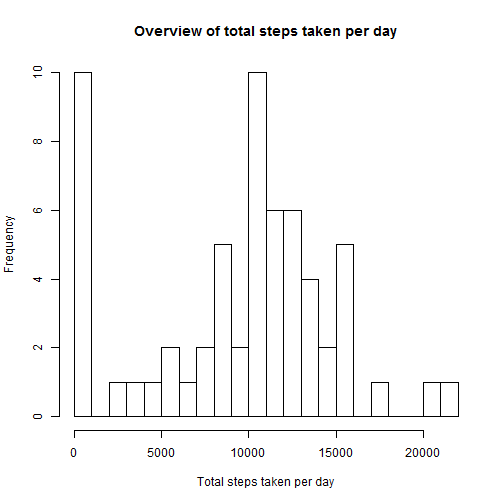
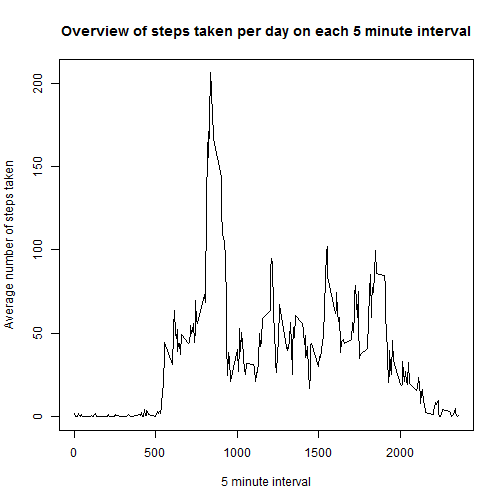
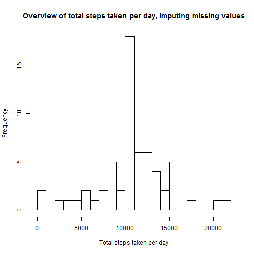
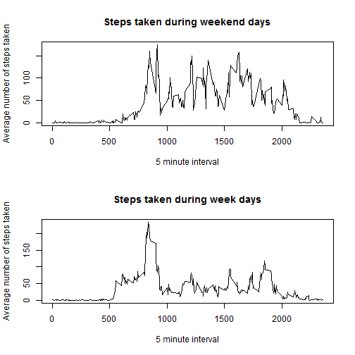

Author: Victor van den Broek


This document describes the steps taken for Peer Assignment 1 from the Reprocible Research course on Coursera. The entire data extraction, analysis, data imputing strategy and other requested items will be outlined through knitr, resulting in this HTML file eventually.

I have used the same headers as in the original file to denote what happens when, along with explanations. 

The starting state for this document was the raw RepData_PeerAssessment1 repository from <https://github.com/rdpeng/RepData_PeerAssessment1>, provided by R.D. Peng from John Hopkins University. The root of that repository is should be the working directory for R.


## Loading and preprocessing the data

As the first step, I unzip the zipfile (and overwrite it if it was already there). Then it will be read into the activity object using read.csv. The contents are checked and printed using the head() function. Finally the dimensions are checked, there should be 17568 rows and 3 variables.

```r
unzip("activity.zip")
activity <- read.csv("activity.csv")
head(activity)
```

```
##   steps       date interval
## 1    NA 2012-10-01        0
## 2    NA 2012-10-01        5
## 3    NA 2012-10-01       10
## 4    NA 2012-10-01       15
## 5    NA 2012-10-01       20
## 6    NA 2012-10-01       25
```

```r
dim(activity)
```

```
## [1] 17568     3
```

The date variable is now mutated to POSIXct, as it is currently a factor variable. A year-month-date American style notation was used.


```r
activity$date <- as.POSIXct(strptime(activity$date,"%Y-%m-%d"))
```

As a final step, required packages for other steps are loaded. There will be some warnings on functions being overwritten after this section. That is nothing to worry about.


```r
library(dplyr)
```
## What is mean total number of steps taken per day?

In this section, the total number of steps taken each day is calculated. NAs are disregarded for this part. A histogram will be plotted with the total number of steps taken each day, and afterwards the mean and median of total number of steps will be reported.

First, lets calculate the total number of steps taken per day using dplyr.


```r
steps.per.day <- activity %>% group_by(date) %>% summarize(total.steps=sum(steps, na.rm=TRUE))
```

Now I'll make a histogram using the base plotting system of the steps per day. Bins are increased to 20 to show distribution a bit better


```r
hist(steps.per.day$total.steps, 
        breaks=20, 
        xlab="Total steps taken per day", 
        main="Overview of total steps taken per day")
```

 

As a final step, the mean and median are calculated and reported here.


```r
summary(steps.per.day$total.steps)[c(3,4)]
```

```
## Median   Mean 
##  10400   9354
```


## What is the average daily activity pattern?

The assignment here asks for two things:
* A time series plot of the 5 minute interval on the x-axis and average number of steps taken across all days on the y-axis
* A value of which 5 minute interval across all days has the maximum number of steps on average

First, calculate the average number of steps taken across each 5 minute interval.


```r
interval <- activity %>% group_by(interval) %>% summarize(average=mean(steps, na.rm=TRUE))
```

Plot the time series, using base plotting system and a line graph


```r
plot(interval$interval, interval$average, 
        type="l",
        main="Overview of steps taken per day on each 5 minute interval",
        xlab="5 minute interval",
        ylab="Average number of steps taken")
```

 

Finally, find the 5 minute interval that has the maximum number of steps taken. From the graph above, it is expected this should be around interval 800-850


```r
interval[which.max(interval$average),]
```

```
## Source: local data frame [1 x 2]
## 
##   interval  average
## 1      835 206.1698
```

## Imputing missing values

The original dataset has missing values. In order to perform further analysis, these missing values have to be imputed. The questions that need to be answered here are:

* Calculate and report the total number of missing values in the dataset
* Devise a strategy for filling in all of the missing values in the dataset. The strategy does not need to be sophisticated. For example, you could use the mean/median for that day, or the mean for that 5-minute interval, etc.
* Create a new dataset that is equal to the original dataset but with the missing data filled in.
* Make a histogram of the total number of steps taken each day and Calculate and report the mean and median total number of steps taken per day. Do these values differ from the estimates from the first part of the assignment? What is the impact of imputing missing data on the estimates of the total daily number of steps?

The total number of missing values it found by using the is.na and sum functions.


```r
## create logical vector of missing values
miss <- is.na(activity$steps)
sum(miss)
```

```
## [1] 2304
```

The strategy I chose to impute the missing values is to substitute them with the average value of that interval across all other days. The reason for this strategy is that it will make sure any patterns in the other days are replicated, such as sleeping at night or walking to a train station and so forth.

I use the ifelse function to fetch the reference data from the interval object using match if the value is missing, and keep the original value if it wasn't missing. I create a new object called imputed to store these values.


```r
## impute missing values
imputed <- activity
imputed$steps <- ifelse(miss, interval$average[match(imputed$interval, interval$interval)], imputed$steps)
```

Now, let's recreate the histogram as done in the first part of the assignment to see the differences.


```r
steps.per.day.imputed <- imputed %>% group_by(date) %>% summarize(total.steps=sum(steps, na.rm=TRUE))
hist(steps.per.day.imputed$total.steps, 
        breaks=20, 
        xlab="Total steps taken per day", 
        main="Overview of total steps taken per day, imputing missing values")
```

 

Finally, let's find the mean and median values again and see how they changed.

```r
#store the previous mean and median values
prev_mean <- mean(steps.per.day$total.steps, na.rm=TRUE)
prev_median <- median(steps.per.day$total.steps, na.rm=TRUE)

## calculate the new mean and median values
new_mean <- mean(steps.per.day.imputed$total.steps)
new_median <- median (steps.per.day.imputed$total.steps)

## print the new mean and median values
summary(steps.per.day.imputed$total.steps)[c(3,4)]
```

```
## Median   Mean 
##  10770  10770
```

```r
## calculate the differences for inline printing
change_mean <- new_mean - prev_mean
change_median <- new_median - prev_median
```

The mean value of total steps taken per day has changed by 1411.959171 while the median value has changed by 371.1886792.


## Are there differences in activity patterns between weekdays and weekends?

The assignments for this section are:

* Create a new factor variable in the dataset with two levels - "weekday" and "weekend" indicating whether a given date is a weekday or weekend day.
* Make a panel plot containing a time series plot (i.e. type = "l") of the 5-minute interval (x-axis) and the average number of steps taken, averaged across all weekday days or weekend days (y-axis). See the README file in the GitHub repository to see an example of what this plot should look like using simulated data.

I use the original dataset again to answer this question. First, add in "weekend-day" or "week-day" as a new factor variable. I also set the locale to an English version as otherwise it will depend on the language of the system you use.


```r
## Set locale to show English days instead of Dutch days
Sys.setlocale("LC_TIME","C")
```

```
## [1] "C"
```

```r
## Make the variable with the name spelled out
activity$name.of.day <- weekdays(activity$date)

## create the base ind.weekday on the activity file and set it to 0 if it is a weekendday, and 1 if it is a weekday.
activity$ind.weekday <- ifelse(activity$name.of.day == "Saturday" | activity$name.of.day =="Sunday", 0, 1)

## make it into an appropriate factor variable
activity$ind.weekday <- factor(activity$ind.weekday, levels=c(0,1), labels=c("Weekend-day","Week-day"))
```

The factor variable is now there. I need to calculate the average steps per weekday/weekendday and per 5 minute interval, and then make a dual panel plot for it. I chose to use the same plot type as before, for consistency reasons.


```r
## Calculate the new average value
new.interval <- activity %>% group_by(ind.weekday, interval) %>% summarize(average=mean(steps, na.rm=TRUE))

## Set plot to 1x2
par(mfrow=c(2,1))

## plot weekenddays first.
weekend <- new.interval[new.interval$ind.weekday=="Weekend-day",]
plot(weekend$interval, weekend$average, type="l",
        xlab="5 minute interval",
        ylab="Average number of steps taken",
        main="Steps taken during weekend days")

## and now weekdays
week <- new.interval[new.interval$ind.weekday=="Week-day",]
plot(week$interval, week$average, type="l",
        xlab="5 minute interval",
        ylab="Average number of steps taken",
        main="Steps taken during week days")
```

 

And that's that! Thank you for reviewing my work and I hope to see you further down the course!
